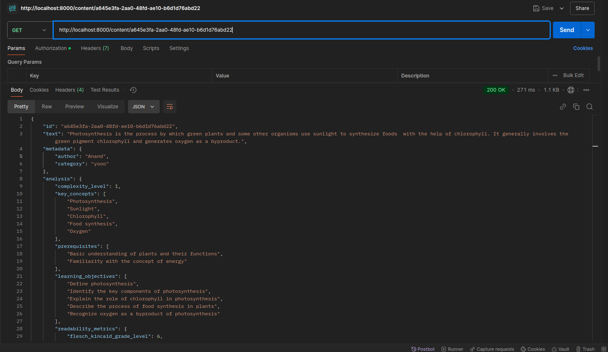
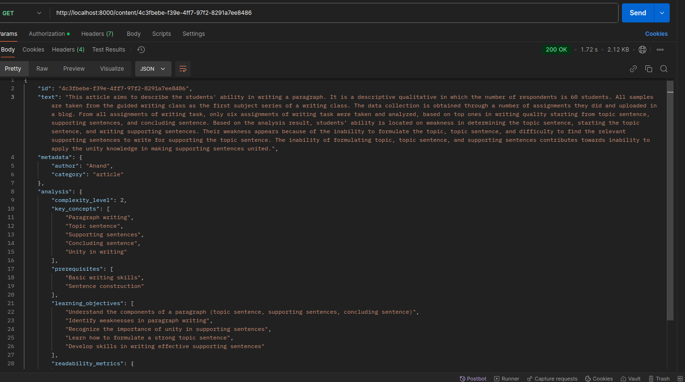
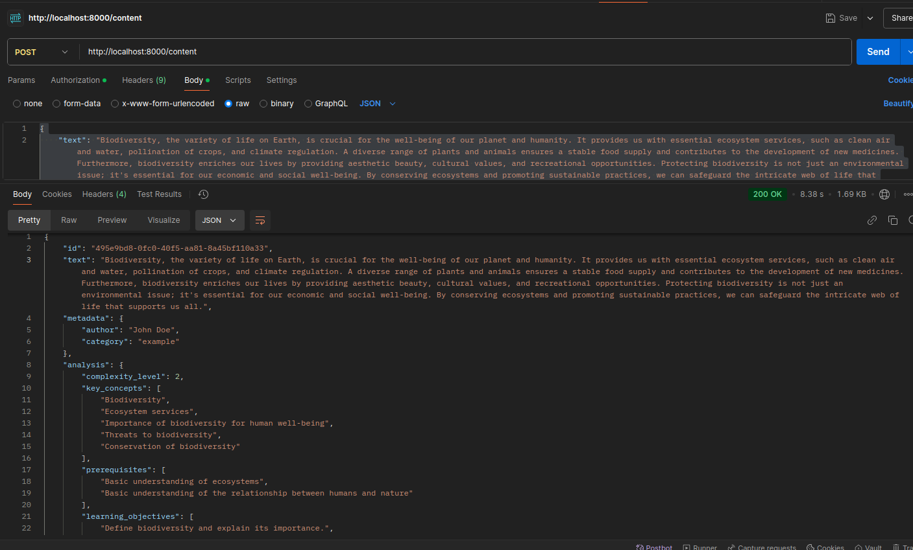
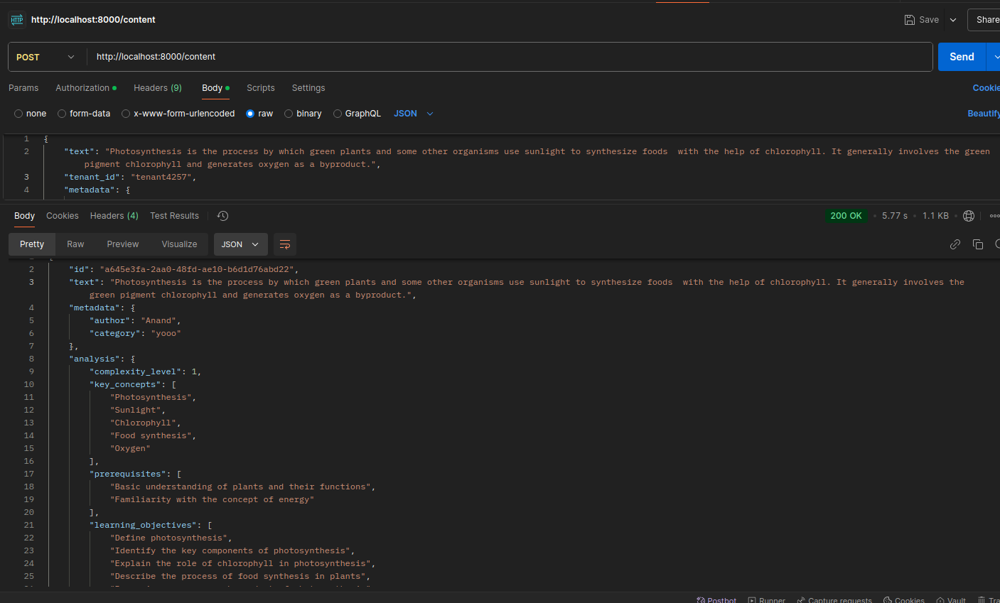
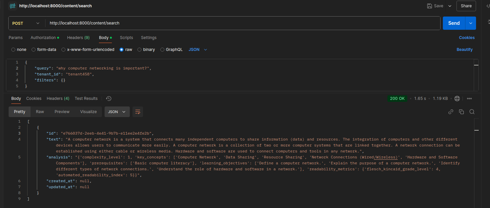
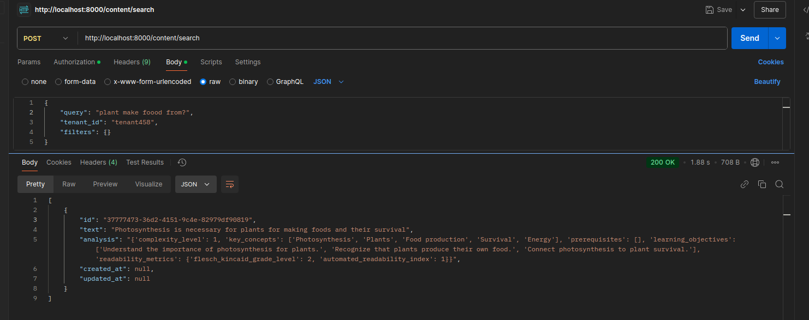
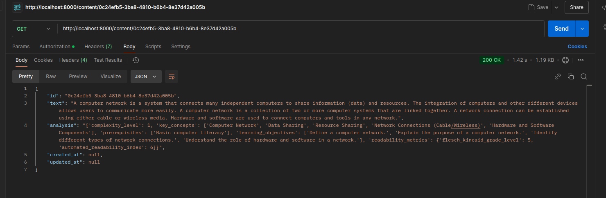

# Content Management System API

This API provides a set of endpoints for managing and searching content in a content management system (CMS). It utilizes AI-powered content analysis and a vector store for efficient search and retrieval.

## API Endpoints

### Create Content
**Endpoint**: `POST /content`
**Request Body**: `ContentRequest`
**Response**: `ContentResponse`

This endpoint allows you to create new content in the CMS. It takes a `ContentRequest` object as input, which includes the content text, metadata, and tenant ID. The API will analyze the content, generate embeddings, and store the content and associated data in the vector store. It will also cache the response for faster retrieval.

### Get Content
**Endpoint**: `GET /content/{content_id}`
**Response**: `Contentanalysis`

This endpoint retrieves the content and analysis data for a specific content ID. It first checks the cache for the content, and if not found, it queries the vector store directly. The response includes the content text, analysis, and metadata.

### Search Content
**Endpoint**: `POST /content/search`
**Request Body**: `SearchRequest`
**Response**: `List[Contentanalysis]`

This endpoint allows you to search for content based on a query and optional filters. It generates embeddings for the query, and then uses the vector store to find the most relevant content. The response includes a list of `Contentanalysis` objects for the top matching content.

## Sample Images

The `images` folder in the repository contains several sample images that can be used with the content management system:

- `getreqwithcontentid.png`: Example of a GET request for content by ID
- `getwithcontentandanalysis.png`: Example of the response for a GET request, including content and analysis
- `postrequestwithcontent.png`: Example of a POST request to create new content
- `postcontentresponse.png`: Example of the response for a content creation request
- `searchrequest.png`: Example of a POST request to search for content
- `searchresponse.png`: Example of the response for a content search request
- `querymatchingbasedontenantidphotosynthesis.png`: Example of a search request with filters
- `responseanalysiscontentwithid.png`: Example of the response for a search request, including content and analysis
The images folder in the repository contains the following sample images that can be used with the content management system:

Example of a GET request for content by ID

Example of the response for a GET request, including content and analysis

Example of a POST request to create new content

Example of the response for a content creation request with metadata

Example of a POST request to search for content

Example of the response for a content search request

Example of a search request with filters

Example of the response for a search request, including content and analysis

These sample images showcase the various API endpoints and their corresponding request and response payloads. They can be used as reference material when interacting with the content management system API.
## Configuration

The system uses the following environment variables, which should be stored in a `.env` file:

- `GEMINI_API_KEY`: API key for the Generative AI service
- `PINECONE_API_KEY`: API key for the Pinecone vector store
- `REDIS_URL`: Connection URL for the Redis cache

## Dependencies

The project uses the following dependencies:

- `fastapi`: For building the API
- `uvicorn`: For running the API server
- `pydantic`: For data modeling
- `python-dotenv`: For loading environment variables
- `google-generativeai`: For content analysis and embedding generation
- `pinecone-client`: For interacting with the Pinecone vector store
- `redis`: For caching
- `pytest`: For unit testing
- `httpx`: For making HTTP requests in tests

